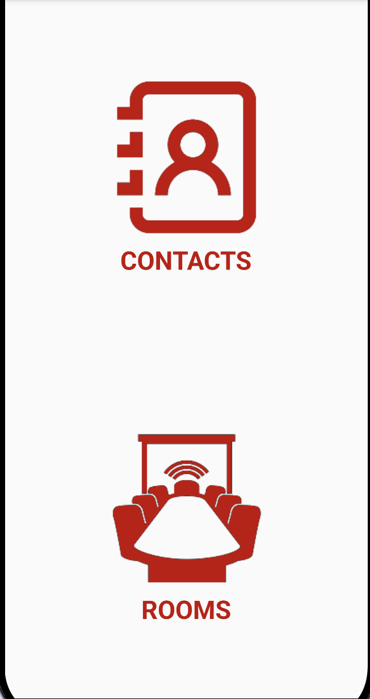
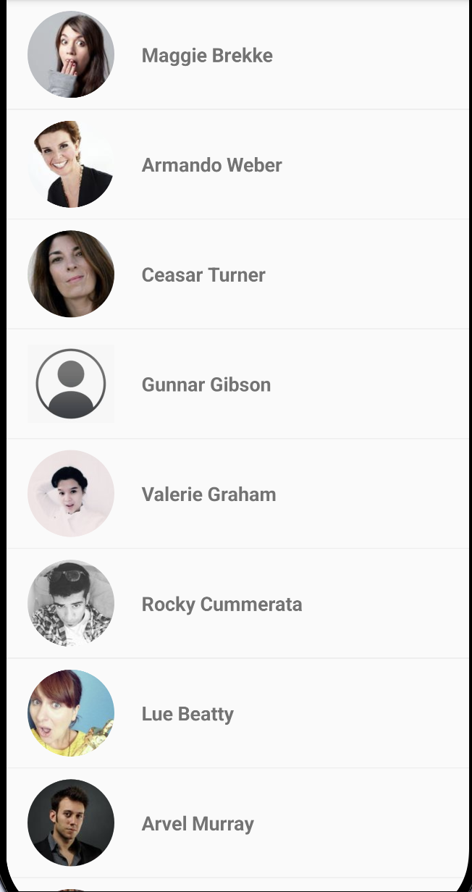
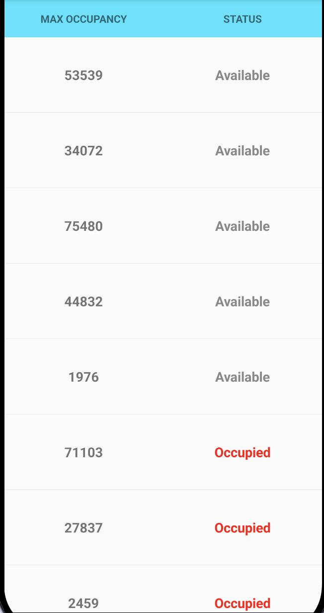

# WorkspaceHub 🏢

[](https://github.com/syeds-dev/workspace-hub-android/actions/workflows/android-ci.yml)


An Android workplace directory app: browse your **colleagues** and check **meeting room availability** from one place.

<p align="center">
  
  &nbsp;
  
  &nbsp;
  
</p>

## ✨ Features

**Contacts**
- Scrollable list of colleagues with profile photo and name
- Placeholder avatar when a contact has no photo
- Details screen with photo, name, email, job title and favourite colour

**Rooms**
- List of meeting rooms with maximum occupancy
- Availability status: **Available** or **Occupied** (occupied rooms highlighted in red)

**Accessibility**
- Content descriptions for buttons, lists, images and screens to support TalkBack

## 🛠 Tech stack

| Area | Libraries |
|---|---|
| Language | Kotlin |
| UI | XML layouts, ViewBinding, RecyclerView, Material Components, ConstraintLayout |
| Navigation | Jetpack Navigation Component |
| Architecture | MVVM + Clean Architecture, Repository pattern |
| Dependency injection | Hilt |
| Async | Kotlin Coroutines, LiveData |
| Networking | Retrofit, Gson, OkHttp + logging interceptor |
| Local storage | Room |
| Image loading | Glide |
| Logging | Timber |
| Testing | JUnit, Robolectric, Truth, Hamcrest, Coroutines Test, Arch Core Testing, Espresso, Hilt Testing |

## 🏗 Architecture

```
UI (Fragments + ViewBinding)
        │  observes LiveData
        ▼
ViewModel (Hilt-injected)
        │  calls
        ▼
Repository  ──►  Remote: Retrofit API
            └─►  Local:  Room database
```

```
app/src/main/java/com/syedsubahani/workspacehub/
 ├── common/       # Shared utilities and helpers
 ├── data/         # API service, DTOs, Room entities and DAOs
 ├── di/           # Hilt modules
 ├── repository/   # Repository implementations
 └── ui/           # Home, Contacts, Contact details and Rooms screens
```

## 🧪 Testing

- **Unit tests** cover ViewModels and repositories using JUnit, Robolectric, Truth and Coroutines Test
- **Instrumentation tests** cover UI flows using Espresso and Hilt Testing

```bash
./gradlew testDebugUnitTest          # unit tests
./gradlew connectedDebugAndroidTest  # UI tests (emulator or device required)
```

Unit tests also run automatically on every push through GitHub Actions.

## 🚀 Getting started

1. Clone the repo
   ```bash
   git clone https://github.com/syeds-dev/workspace-hub-android.git
   ```
2. Open in Android Studio and let Gradle sync
3. Run on an emulator or device (Android 4.4+, minSdk 19)

## 🗺 Roadmap

- [ ] Rebuild the UI with Jetpack Compose and Material 3
- [ ] Migrate LiveData to StateFlow
- [ ] Search and filter contacts
- [ ] Filter rooms by availability
- [ ] Dark theme

## 👤 Author

**Syed Subahani**, Senior Android Engineer
[LinkedIn](https://linkedin.com/in/subahani-syed-240bb0112) · [Portfolio](https://syeds.pages.dev) · syeds.androiddev@gmail.com
